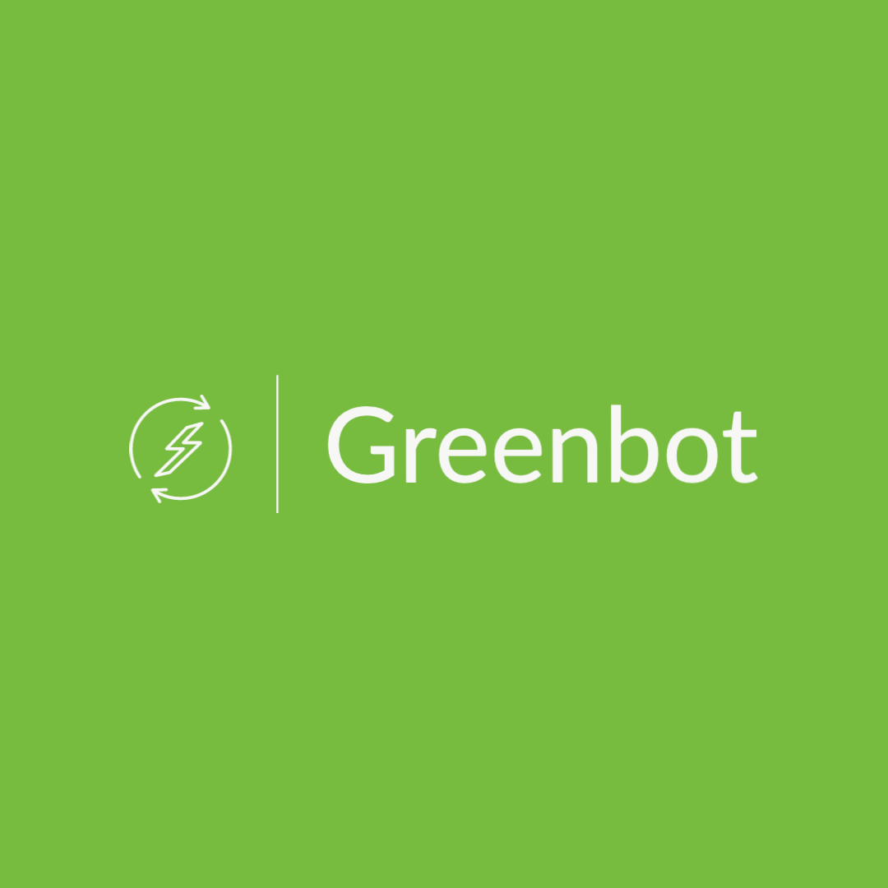

# Greenbot - Mulesoft Hackathon 2021 Submission

## Inspiration

Human activities have increased the concentration of carbon dioxide in our atmosphere, amplifying Earth's natural greenhouse effect. Despite the global pandemic, the global average amount of carbon dioxide hit a new record high in 2020: 412.5 parts per million. The annual rate of increase in atmospheric carbon dioxide over the past 60 years is about 100 times faster than previous natural increases.

Carbon dioxide concentrations are rising mostly because of the fossil fuels that people are burning for energy. On the other hand, green energy is important for the environment as it replaces the negative effects of fossil fuels with more environmentally friendly alternatives. Derived from natural resources, green energy is also often renewable and clean, meaning that they emit no or few greenhouse gases and are often readily available.

Even though share of renewable energy more than doubled between 2004 and 2019 in the European Union, the global share is still less than 20%. That’s why, almost no country in the world can provide 100% renewable energy to industry and households.  

The share of renewable energy in total supply to a household differs during the day based on usage on the grid. For example, during prime time in Germany, share of renewable energy decreases to 40%. On the other hand, during the day share of renewable energy can go up to 85%.

With smart and eco-friendly usage, consumers can decrease their personal CO2-Footprint up to 80%. We wanted to help individuals to decrease their personal CO2-Footprint, by finding optimal usage times during the day.

## What it does

Greenbot helps individuals to reduce their carbon footprint by starting/runninng their IoT devices when the electricity coming from the grid is greener.

Currently it is Chatbot that can be accessed via Telegram but it can be extended to additional channels in the future. 

Users can chat with Greenbot when they would like to start their home appliances. Greenbot checks the carbon dioxide index of the electricity for the users location in the next 24 hours and proposes the times with most green energy to the user for the potential start time. 

After users selection, Greenbot stars the Home Appliance at the defined time and notify user when it is running. 

## How we built it

Today, users can already delayed-start their appliances at home from the appliance directly or from respective app if the appliance is connected and if they are interested they can try to find out the carbon dioxide index of their electricity every time to decide ideal delayed-start time.

We have automated this by introducing Mulesoft to the loop. Mulesoft let us check the carbon dioxide index from Corrently API and find the values for the next 24 hours. In addition, by connecting to Home Connect API, we were able to program home appliances to start at certain time. 

Only part missing here is a front end for this automation to let user to select certain program or control this automation. We thought, Chatbot would be a nice, user-friendly interface for this purpose. 

For the connection to Chatbot, we have used FlowXO. By connecting FlowXO to Mulesoft, we were able to build both our Telegram and Web bot at the same time.

## Challenges we ran into

Thanks to Mulesoft, we haven't faced any technical challenge, actual challenge was to understand the how we should approach to different locations. At the beginning we were aware of the increased carbon dioxide footprint and some eco-friendly electricity options are available but we were not aware that it might differ during the day and also based on the actual demand. 

## Accomplishments that we're proud of

We were able to bring everything together in a very short time and completely remote. It is quite motivating.

## What we learned

We were aware about our Carbon footprint but were not aware that even a single person with smart and eco-friendly usage, can decrease their personal CO2-Footprint up to 80%. This inspired us even more to dig deeper on this topic.

## What's next for Greenbot - Reduce your Carbon Footprint

Definitely more appliances and other electric devices at home. This can even be extended for people with solar panels, so that they charge their electric vehicle when panels can provide enough input. 
